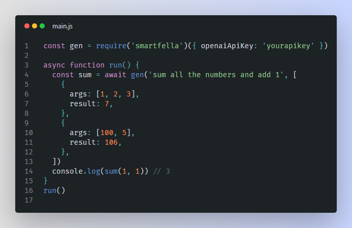

# Smartfella - AI Functions Generator

### Pass prompt and examples(that also tests) and AI will generate you function for that!

## Example



## Features

- AI will be trying to generate function until it works
- The tests provided by you will be used to verify the correctness of the function. If the function does not pass them - it will try again
- When correct function will be created Smartfella will cache it in json file so you don't need to generate the same function again
- If AI function would try to import non-installed module it will install it automatically (can be disabled)

## Use

```javascript
const gen = require('smartfella')({
  openaiApiKey: '', // by default uses openai api with text-davinci-003 for generation. You must specify api token for this
  customGenerateCode: null, // Or you may provide your own generate code function. It must take prompt and return AI generated code
  autoInstallModules: true, // automatically install modules if AI generated code would require them
  enableLogs: true, // enable Smartfella console logs
})
const func = await gen(
  'concat strings and reverse final string', // prompt for what function must do
  [
    {
      args: ['apple', 'banana'],
      result: 'ananabelppa',
    },
    {
      args: ['word'],
      result: 'drow',
    },
  ] // examples
)
console.log(func('123')) // 321
```
